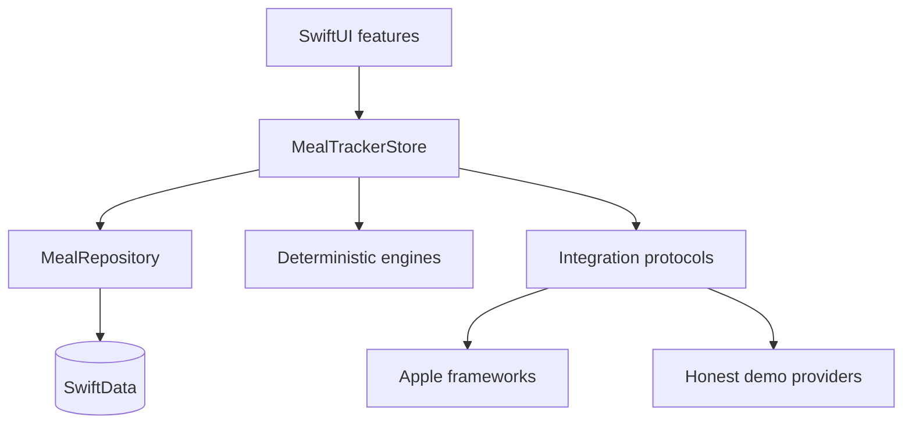

# Native architecture and invariants

## Dependency flow

SwiftUI feature views send intent to `MealTrackerStore`. The store coordinates `MealRepository` and integration protocols. Domain engines have no dependency on SwiftUI, SwiftData, HealthKit, location, or network services.

## Day identity

An entry stores three independent facts:

- `consumedAt`: absolute timestamp
- `localDayIdentifier`: the resolved calendar day at log time
- `timeZoneIdentifier`: the timezone used to resolve that day

Queries group by `localDayIdentifier`; they do not recalculate old entry days in the current timezone. A past-day add creates a consumption timestamp inside the recorded day and timezone. Significant-time-change and scene-active events refresh the current local day.

## Completion and streaks

- Resolution is derived per category: an entry wins over a prior Skipped / None state; otherwise explicit skipped; otherwise unresolved.
- All four categories must be resolved. Nutrition values and targets never participate.
- Streaks are recomputed from current historical day state. Missing or incomplete closed days break a chain.
- A historical edit can restore a chain immediately.
- Lifetime complete days are counted from idempotent day-completion reward ledger events, so earned permanent progress does not disappear after a later edit.

## Rewards and Undo

- One meal entry creates one `meal:<UUID>` event worth three energy, regardless of ingredient count.
- First completion of a day creates one `day:<yyyy-MM-dd>` event worth eight energy.
- Ledger source IDs make awards idempotent.
- Immediate Undo removes the accidental entry event and any completion event created by that same action.
- Ordinary later deletion or incompleteness does not deduct banked adventure resources.

## Prediction learning

`SeedMealCatalog` is cold-start content with `starter` provenance. It is not personal history. Ranking uses actual `MealEntry` records only for frequency, recency, weekday, portion, and correction signals. Searches and viewed cards create no record. The latest logged ingredient choices and portion are applied to the next draft; correction count gives recent corrected behavior stronger ranking weight.

## Integration boundary

`MealTextAnalyzing`, `MealPhotoAnalyzing`, `VoiceTranscribing`, `VenueResolving`, `RestaurantMenuSearching`, `HealthKitReading`, and `AdventureContentGenerating` keep private-provider work out of features. Native services own contextual Apple permission calls. Demo services return explicit disclosure text or an unavailable state; the UI never presents them as live.
